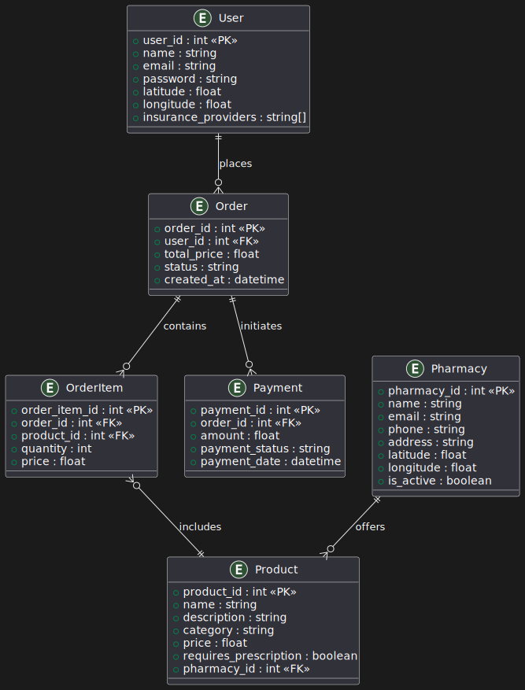

# 💊 Farumasi Pharmacy Backend

Farumasi is a backend API for connecting users with nearby pharmacies. It supports medicine ordering with or without prescriptions, integrates mobile payment (MoMo), and includes admin-level controls for reviewing prescription-based orders.

---

## 📦 Features

- 🌍 Location-aware pharmacy assignment
- 📋 Prescription-based or manual product ordering
- 📄 File uploads (prescriptions)
- 🧾 Insurance-based discounts
- 📱 MoMo payment API integration
- 👨‍⚕️ Admin review for prescription orders

---

## 🚀 Tech Stack

| Tool        | Purpose                       |
|-------------|-------------------------------|
| Node.js     | Backend runtime               |
| Express     | API framework                 |
| SQLite3     | Database                      |
| Multer      | File uploads                  |
| Axios       | HTTP requests                 |
| MTN MoMo API| Mobile payment integration    |

---

## ⚙️ Setup

1. Clone the project
2. Install dependencies  
   ```bash
   npm install

3. Create .env file with:

### env

MOMO_BASE_URL=...
MOMO_SUBSCRIPTION_KEY=...
MOMO_TARGET_ENV=...
MOMO_API_USER=...
MOMO_API_KEY=...

## Start the server

    ```bash
    node server.js
  ```
## 📂 Project Structure
```bash
.
├── controllers/
├── models/
├── routes/
├── utils/
├── uploads/
├── server.js
├── README.md
└── .env
```

## 🧪 Testing
### Use Postman to test:

Orders: form-data for prescription files

Payments: JSON format

Auth: JWT or token-based access (authMiddleware)


## 📡 API ROUTES DOCUMENTATION (Frontend Guide)

---

### 🧑‍💼 Auth Routes ('/api/auth')

| Method | Endpoint                 | Description               | Auth | Body |
|--------|--------------------------|---------------------------|------|------|
| POST   | `/register`              | User registration         | ❌   | `name`, `email`, `password` |
| POST   | `/login`                 | User login (returns token)| ❌   | `email`, `password` |
| PUT    | `/update-location`       | Update user’s location    | ✅   | `latitude`, `longitude` |

---

### 📍 Location Routes ('/api/locations')

| Method | Endpoint                        | Description                    |
|--------|----------------------------------|--------------------------------|
| PUT    | `/update/user/:userId`          | Update user location by ID     |
| GET    | `/user/:userId`                 | Get user location              |
| PUT    | `/update/pharmacy/:pharmacyId`  | Update pharmacy location       |
| GET    | `/pharmacy/:pharmacyId`         | Get pharmacy location          |
| GET    | `/`                              | Get all locations              |

---

### 🏥 Pharmacy Routes ('/api/pharmacies')

| Method | Endpoint     | Description              |
|--------|--------------|--------------------------|
| POST   | `/`          | Register a new pharmacy  |
| GET    | `/`          | List all pharmacies      |
| GET    | `/:id`       | Get pharmacy by ID       |

---

### 💊 Product Routes ('/api/products')

| Method | Endpoint   | Description                      |
|--------|------------|----------------------------------|
| POST   | `/`        | Add a new product (with image)   |
| GET    | `/`        | List all products                |
| GET    | `/:id`     | Get product by ID                |
| PUT    | `/:id`     | Update product info              |
| DELETE | `/:id`     | Delete product                   |

---

### 📦 Order Routes ('/api/orders')

| Method | Endpoint                             | Description                                               |
|--------|---------------------------------------|-----------------------------------------------------------|
| POST   | `/`                                   | Place an order (optional: upload prescription)            |
| GET    | `/`                                   | Get all orders                                            |
| GET    | `/user/:user_id`                      | Get all orders for a user                                 |
| GET    | `/pharmacy/:pharmacy_id`              | Get all orders for a pharmacy                             |
| GET    | `/:id`                                 | Get specific order by ID                                  |
| PUT    | `/:id/status`                         | Update order status (pending → paid / canceled, etc.)     |
| PUT    | `/prescription-review`                | Admin updates prescription order (adds items, insurance)  |
| DELETE | `/:id`                                 | Delete/cancel order                                       |

> ℹ️ When uploading a prescription, use `form-data` and add the file with key `prescription_file`.

---

### 💰 Payment Routes [MoMo API] ('/api/payment')

| Method | Endpoint               | Description                        |
|--------|------------------------|------------------------------------|
| POST   | `/pay`                 | Initiate payment (MoMo)            |
| GET    | `/status/:referenceId` | Check payment status by reference  |

---
## 📜 API Deep Documentation

> ℹ️ for more detailed documentation, use `API_Documentation.md` file in the root directory.

---

## 📑 Final Report Summary

### 🎯 Purpose

The **Farumasi Backend API** provides a complete system for medicine ordering and delivery. It supports two order types:

1. Manual Product Order  
2. Prescription-Based Order (file upload)

### 🧠 Key Logic Rules

| Case | Input                              | Outcome                              |
|------|------------------------------------|--------------------------------------|
| 1️⃣   | Items only                         | Auto-pick pharmacy → status: `pending` |
| 2️⃣   | Prescription only                  | Nearest pharmacy → status: `pending_prescription_review` |
| 3️⃣   | Invalid (no prescription or items)| Rejected                             |
| 4️⃣   | Both items + prescription         | Rejected                             |

### 🔐 Admin Controls

- Review prescription orders
- Assign products based on prescription
- Update insurance provider
- Change order status
- register pharamacy
- populate products of registered pharamacy into database 

### 🔁 Payment Flow

1. Backend sends payment request to MoMo
2. MoMo returns `referenceId`
3. Backend stores it under `payments` table
4. `/status/:refId` used to check/confirm transaction

---

## 🗂️ Database Schema (ERD)

The following Entity Relationship Diagram (ERD) shows how the tables in the Farumasi system relate to one another:



- `users` are linked to `locations` and `orders`
- `pharmacies` own `products` and also have `locations`
- `orders` can contain multiple `order_items` and are tied to `payments`
- Some `products` may require a `prescription_file`

---

## 🧩 Explanation of Database Entities and Relationships

### 📌 Entities

#### 👤 User
Represents the customers using the pharmacy service.
- `user_id`: Unique identifier for each user.
- `insurance_providers`: List of insurance providers associated with the user.

#### 🏪 Pharmacy
Represents the pharmacies offering products.
- `pharmacy_id`: Unique identifier for each pharmacy.

#### 💊 Product
Represents the products available in pharmacies.
- `pharmacy_id`: Foreign key linking to the Pharmacy entity.

#### 📦 Order
Represents orders placed by users.
- `user_id`: Foreign key linking to the User entity.

#### 🧾 OrderItem
Represents individual items within an order.
- `order_id`: Foreign key linking to the Order entity.
- `product_id`: Foreign key linking to the Product entity.

#### 💳 Payment
Represents payment transactions for orders.
- `order_id`: Foreign key linking to the Order entity.

---

### 🔗 Relationships

- A **User** can place multiple **Orders**.
- An **Order** can contain multiple **OrderItems**.
- An **OrderItem** includes one **Product**.
- A **Pharmacy** can offer multiple **Products**.
- An **Order** can have one associated **Payment**.

---
## 🧭 System Flow Diagrams

This section provides a high-level overview of how users and administrators interact with the pharmacy system. These diagrams help explain the journey each role takes within the system, from registration and product selection to prescription processing and payment.

### 👤 User Flow

The **User Flow Chart** illustrates the main steps a typical user (customer) follows when using the platform:

- Registers and logs in.
- Updates their location.
- Either selects medicines directly or uploads a prescription.
- Waits for prescription review (if applicable).
- Makes a payment once the order is ready.



> 💡 This flow ensures that users can easily place an order even with prescriptions and insurance, allowing for flexible interaction with pharmacies.

---

### 🛡️ Admin Flow

The **Admin Flow Chart** describes the core activities an administrator performs:

- Registers pharmacies and adds their products.
- Reviews prescriptions uploaded by users.
- Adds appropriate items and insurance details to those orders.
- Approves orders and updates their statuses.
- Monitors payments and pharmacy performance.



> 🔐 Admins ensure data integrity, handle sensitive prescription logic, and bridge users with physical pharmacies by keeping the platform up-to-date.

---

These diagrams serve as a reference for developers, designers, and testers to understand how different roles interact with the system and what decisions are automated vs. manual.


